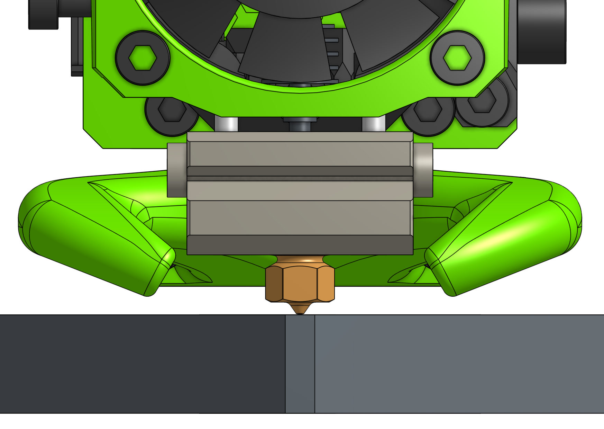
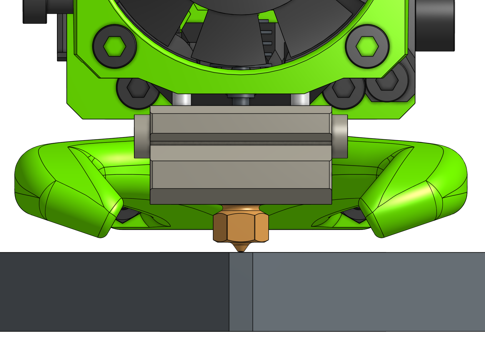
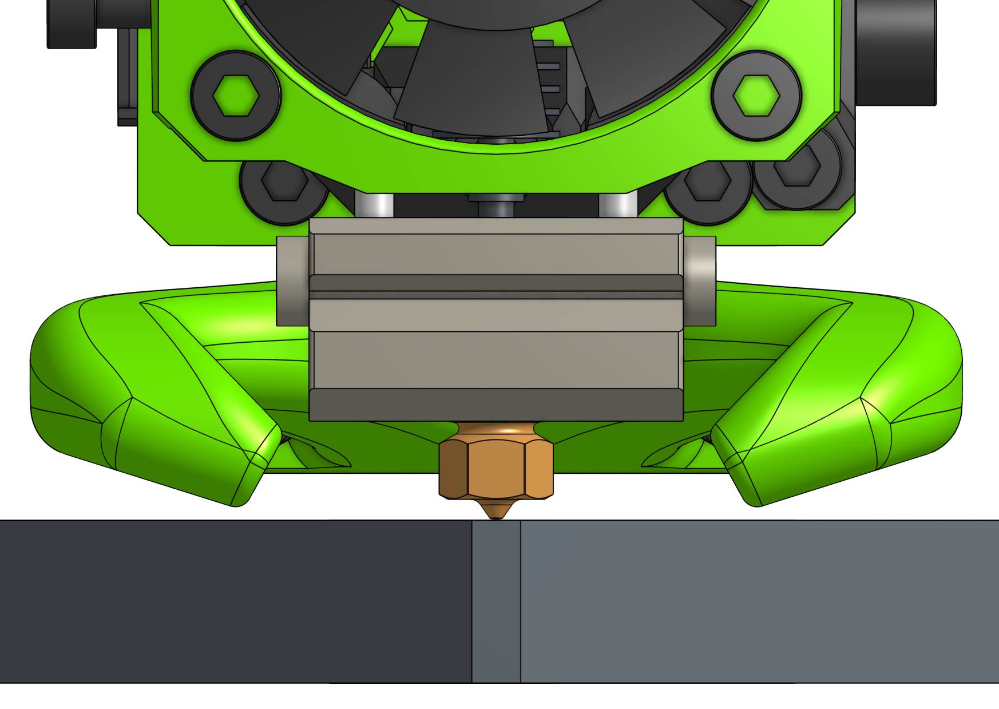
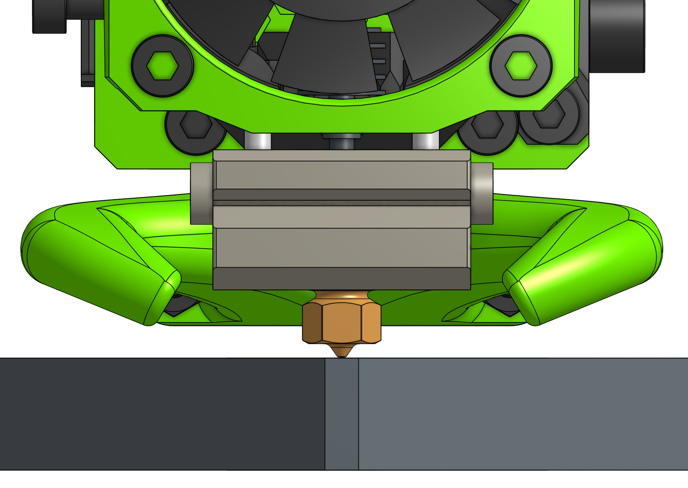
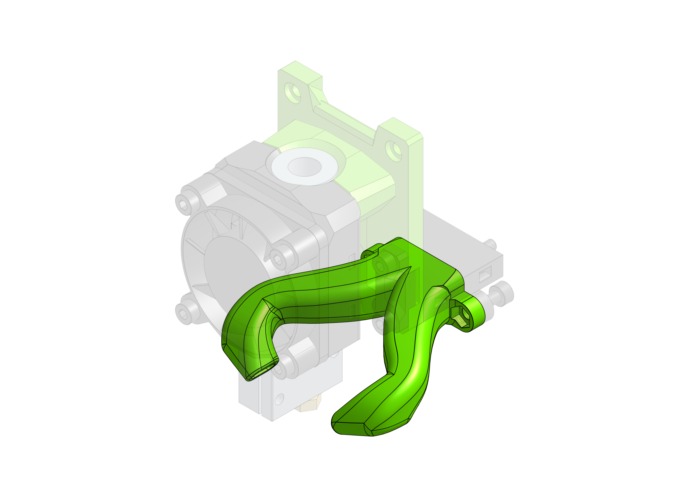

# Custom Fan Ducts

This addon is all about custom layer cooling that your setup may require.

If you have a fan duct you'd like contribute to EVA please let us know.

## Horns Duct Variants

Due to issues with different assemblies - print tolerances / compatibility with other than PETG materials - you might find that the modified duct variants of the default Horns Duct will work better for you application. All of those come in the "straight" and "angled" (for Hemera) variants.

Please check the dimmensions for each compared side by side in [:octicons-file-24: this document](assets/duct_variants.pdf).

### Default

The default variant you can find attached to all of the drives.

Horns Span: `25.33 mm`  
Distance from nozzle tip: `1.79 mm`

[Download :octicons-download-16:](stls/Duct v2.1 Straight.stl)
[Download (angled) :octicons-download-16:](stls/Duct v2.1 Angled 20deg.stl)

### Wide

For those who's duct like to melt.

Horns Span: `29.79 mm`  
Distance from nozzle tip: `1.76 mm`

[Download :octicons-download-16:](stls/Duct v2.1 Straight Wide.stl)
[Download (angled) :octicons-download-16:](stls/Duct v2.1 Angled 20deg Wide.stl)

### Low

Much like one of the older versions of Horns Ducts - not suitable for eveyone but keep cold air away from the hotend a bit more than the others.

Horns Span: `26.94 mm`  
Distance from nozzle tip: `0.75 mm`

[Download :octicons-download-16:](stls/Duct v2.1 Straight Low.stl)
[Download (angled) :octicons-download-16:](stls/Duct v2.1 Angled 20deg Low.stl)

### Wide and High

The safest variant - away from the print surface and hotend.

Horns Span: `28.69 mm`  
Distance from nozzle tip: `2.8 mm`

[Download :octicons-download-16:](stls/Duct v2.1 Straight Wide High.stl)
[Download (angled) :octicons-download-16:](stls/Duct v2.1 Angled 20deg Wide High.stl)

## Different Fan Ducts

### Volcano

The Horns Duct v2 variant for E3D Volcano. It takes the standard EVA air output from the back and directs it to the tip of a Volcano nozzle which is considerably lower than it is with other hotends.

[Download :octicons-download-16:](stls/[Duct] v2 Volcano Configurable - Duct v2 Volcano Straight Risen.stl)

### RHD Duct

In 1.3.0 a [MK3 RHD Fan Duct Rev. C](https://www.thingiverse.com/thing:3249344) remix was added, it does not have a Volcano variant but is narrower than Horns Duct which maybe important for an IDEX assembly

[Download :octicons-download-16:](stls/RHD - RHD_for_EVA_fan_duct.stl)
